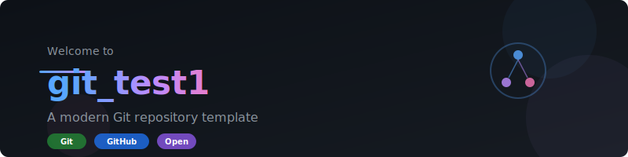

<p align="center">
  
</p>

<p align="center">
  
  
  
  
</p>

---

## 📖 关于项目

这是一个 Git 学习与实践仓库，用于记录和探索 Git/GitHub 的各种功能与最佳实践。

同时也作为个人工作区的归档仓库，记录日常开发中的工具、脚本和项目。

<details>
<summary>🎯 点击展开项目目标</summary>

- ✅ 学习 Git 基础操作（add, commit, push, pull）
- ✅ 掌握分支管理与合并策略
- ✅ 理解 Git 工作流（Git Flow, GitHub Flow）
- ✅ 实践团队协作开发模式
- 🔄 探索 GitHub Actions CI/CD
- 📝 记录踩坑经验与解决方案

</details>

## 🚀 快速开始

### 克隆仓库

```bash
git clone https://github.com/a1197245724/git_test1.git
cd git_test1
```

### 基本工作流

```bash
# 创建新分支
git checkout -b feature/your-feature

# 做出修改后提交
git add .
git commit -m "feat: 添加新功能"

# 推送到远程
git push origin feature/your-feature
```

## 📁 项目结构

```
git_test1/
├── assets/              # 静态资源（图片、图标等）
│   └── banner.svg       # 项目 Banner
├── .gitignore           # Git 忽略规则
└── README.md            # 项目说明文档
```

## 📦 归档内容（工作区）

以下为本地工作区（OpenClaw workspace）的主要项目，已归档至本仓库：

| 项目 | 说明 | 技术栈 |
|:---:|:---:|:---:|
| **迅维课堂下载器** | 抓取加密视频，解密转 MP4 | Python 3.12 + tkinter + Puppeteer |
| **B站视频抓取** | Bilibili 视频下载工具 | Node.js + yt-dlp |
| **坦克大战** | HTML5 小游戏 | HTML + CSS + JS |
| **OpenClaw 配置** | AI 助手配置与记忆系统 | Markdown |

## 📝 更新日志

### 2026-06-13
- ✅ 初始化本地 Git 仓库
- ✅ 连接远程仓库 `github.com/a1197245724/git_test1.git`
- ✅ 配置 Git 代理（`127.0.0.1:7897`）
- ✅ 创建 `.gitignore`（覆盖 Node.js/Python/OS/IDE 等）
- ✅ 编写精美 README.md + SVG banner 配图
- ✅ 工作区全量归档（60 个文件，含迅维下载器、B站抓取等）
- ✅ B站视频下载：《普通人怎么用好Git和GitHub》

## 🛠️ Git 常用命令速查

<table>
<tr>
<td width="50%">

### 📌 基础操作
```bash
git status          # 查看状态
git add .           # 暂存所有修改
git commit -m ""    # 提交修改
git push            # 推送到远程
git pull            # 拉取远程更新
```

</td>
<td width="50%">

### 🌿 分支管理
```bash
git branch          # 查看分支
git checkout -b     # 创建并切换分支
git merge           # 合并分支
git rebase          # 变基操作
git stash           # 暂存工作区
```

</td>
</tr>
</table>

## 📊 提交规范

使用 [Conventional Commits](https://www.conventionalcommits.org/) 规范：

| 类型 | 说明 | 示例 |
|:---:|:---:|:---:|
| `feat` | 新功能 | `feat: 添加用户登录` |
| `fix` | 修复 Bug | `fix: 修复登录超时` |
| `docs` | 文档更新 | `docs: 更新 README` |
| `style` | 代码格式 | `style: 格式化代码` |
| `refactor` | 重构 | `refactor: 重构登录模块` |
| `chore` | 构建/工具 | `chore: 更新依赖` |

## 🤝 贡献指南

欢迎提交 Issue 和 Pull Request！

1. Fork 本仓库
2. 创建你的特性分支 (`git checkout -b feature/AmazingFeature`)
3. 提交你的修改 (`git commit -m 'feat: Add some AmazingFeature'`)
4. 推送到分支 (`git push origin feature/AmazingFeature`)
5. 打开一个 Pull Request

## 📬 联系方式

<p align="center">
  <a href="https://github.com/a1197245724">
    
  </a>
  <a href="mailto:1197245724@qq.com">
    
  </a>
</p>

---

<p align="center">
  <sub>⭐ 如果这个项目对你有帮助，欢迎点个 Star 支持一下！</sub>
</p>
